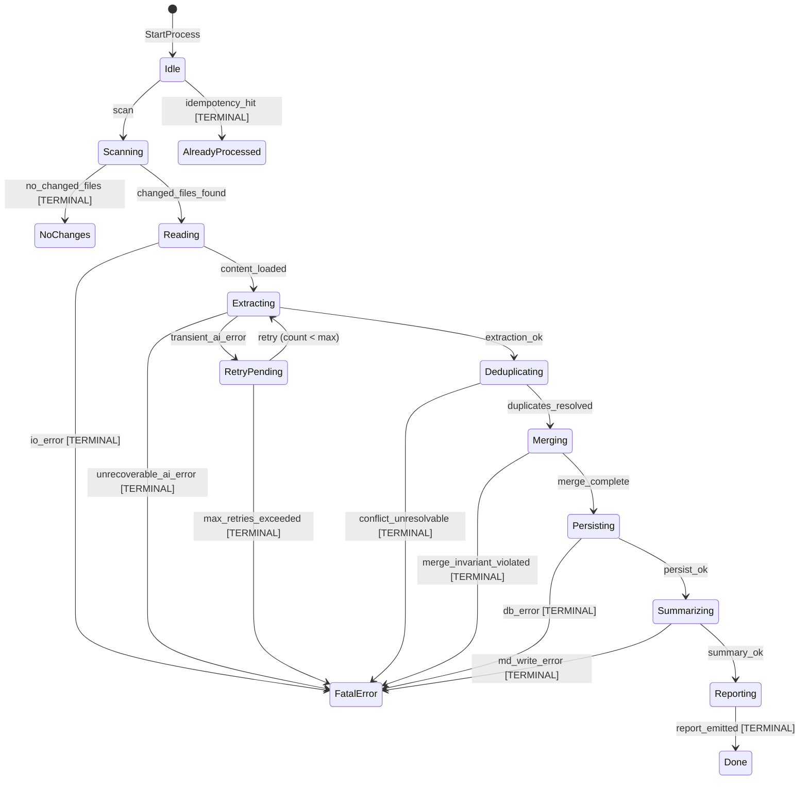
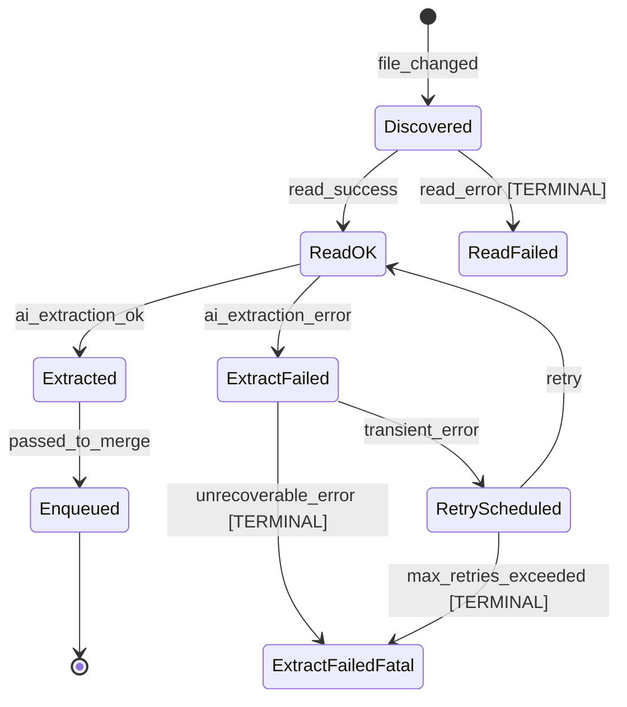
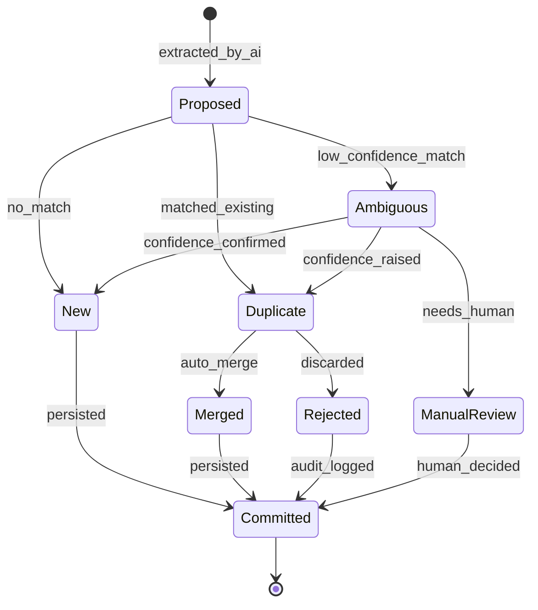

# Dear Diary AI 提炼系统 — 状态机设计

> 在产品实现之前，先用状态机严格定义 `diary process` 的行为边界。  
> 任何非法状态转移都必须在运行时抛出错误，绝不允许 AI 或代码把系统拖入未知状态。

---

## 1. 设计原则

1. **显式状态（Explicit States）**  
   不允许用布尔标志或隐式状态表示处理进度。每个阶段必须是一个独立的状态。

2. **转移许可表（Allow-list Transitions）**  
   状态转移必须查表。不在表里的转移一律报错，而不是默默成功。

3. **终端状态（Terminal States）**  
   `Done`、`NoChanges`、`FatalError` 是终端状态，进入后不可再转移。

4. **幂等令牌（Idempotency Token）**  
   每个 process run 用 `(base_hash, run_id)` 做令牌。同一批输入已经成功后，重复触发必须直接进入 `AlreadyProcessed`（终端状态）。

5. **错误分层**  
   - `TransientError`：可重试，进入 `RetryPending`。  
   - `FatalError`：不可重试，进入终端状态并记录审计日志。

---

## 2. 顶层流程状态机（Process Run）

### 2.1 状态说明

| 状态 | 含义 | 是否终端 |
|---|---|---|
| `Idle` | 等待触发 | 否 |
| `Scanning` | 扫描日记目录，计算文件 hash/mtime | 否 |
| `NoChanges` | 没有需要处理的变更 | 是 |
| `AlreadyProcessed` | 同一输入已经处理成功 | 是 |
| `Reading` | 读取变更文件内容 | 否 |
| `Extracting` | 调用 AI 提取 Todo/Memory/Question | 否 |
| `RetryPending` | 暂态错误，等待重试 | 否 |
| `Deduplicating` | 与现有实体做去重/匹配 | 否 |
| `Merging` | 合并、更新、新增实体 | 否 |
| `Persisting` | 写入 SQLite | 否 |
| `Summarizing` | 生成 Markdown 摘要 | 否 |
| `Reporting` | 输出命令行报告 | 否 |
| `Done` | 处理成功完成 | 是 |
| `FatalError` | 不可恢复错误 | 是 |

### 2.2 允许转移表

| 当前状态 | 事件 | 下一状态 | 触发条件/备注 |
|---|---|---|---|
| `Idle` | `StartProcess` | `Scanning` | 收到 `diary process` 命令 |
| `Idle` | `IdempotencyHit` | `AlreadyProcessed` | `(base_hash, run_id)` 已存在成功记录 |
| `Scanning` | `NoChanges` | `NoChanges` | 没有文件变更 |
| `Scanning` | `ChangesFound` | `Reading` | 有新增/修改文件 |
| `Reading` | `ContentLoaded` | `Extracting` | 所有变更文件内容已读入 |
| `Reading` | `IOError` | `FatalError` | 读取文件失败 |
| `Extracting` | `ExtractionOK` | `Deduplicating` | AI 返回结构化结果 |
| `Extracting` | `TransientAIError` | `RetryPending` | AI 超时/限流/格式错误可重试 |
| `Extracting` | `UnrecoverableAIError` | `FatalError` | AI 返回非法/不可解析结果 |
| `RetryPending` | `Retry` | `Extracting` | 重试计数未超限 |
| `RetryPending` | `MaxRetriesExceeded` | `FatalError` | 超过最大重试次数 |
| `Deduplicating` | `DuplicatesResolved` | `Merging` | 去重算法完成 |
| `Deduplicating` | `ConflictUnresolvable` | `FatalError` | 冲突无法自动解决 |
| `Merging` | `MergeComplete` | `Persisting` | 实体合并完成 |
| `Merging` | `MergeInvariantViolated` | `FatalError` | 合并后数据违反不变式 |
| `Persisting` | `PersistOK` | `Summarizing` | SQLite 写入成功 |
| `Persisting` | `DBError` | `FatalError` | 数据库写入失败 |
| `Summarizing` | `SummaryOK` | `Reporting` | Markdown 生成成功 |
| `Summarizing` | `MDWriteError` | `FatalError` | Markdown 写入失败 |
| `Reporting` | `ReportEmitted` | `Done` | 命令行报告输出 |

---

## 3. 单文件处理状态机（File Unit）

每个被扫描到的文件都有自己的微型状态机，便于追踪哪一步出错、哪一步需要重试。

---

## 4. 实体生命周期状态机（Entity）

提取出来的每个 Todo / Memory / Question 都要进入实体状态机，确保去重和合并过程可追溯。

---

## 5. 不变式（Invariants）

状态机实现必须保证以下不变式，测试用例需要覆盖：

1. **终端状态不可转移**  
   `Done`、`NoChanges`、`AlreadyProcessed`、`FatalError` 不接受任何事件。

2. **重试次数有上限**  
   `RetryPending` 只能在 `retryCount < maxRetries` 时转移回 `Extracting`。

3. **幂等性**  
   同一 `(base_hash, run_id)` 成功处理后，再次触发直接返回 `AlreadyProcessed`，不调用 AI。

4. **无隐式状态**  
   不允许通过修改某个布尔值绕过 `Transition()` 方法改变状态。

5. **审计日志**  
   每次状态转移必须记录 `(from, to, event, timestamp, run_id)`。

---

## 6. 实现位置

- `internal/process/statemachine.go`：状态机核心实现
- `internal/process/statemachine_test.go`：不变式与转移测试
